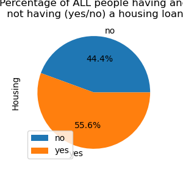
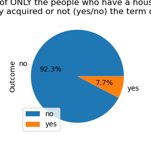
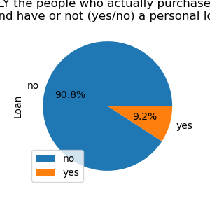
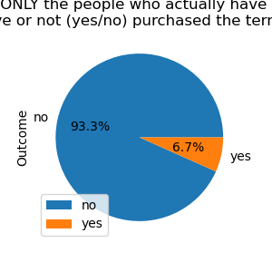

# Project_1

## Introduction
This Repository has analysis based on a financial product called "TERM DEPOSIT"
Term deposits are a major source of income for a bank. A term deposit is a cash investment held at a financial institution. The money the customer invests is held for an agreed rate of interest over a fixed amount of time, or term. The bank uaes various outreach plans to sell term deposits to their customers such as email marketing, advertisements, telephonic marketing, and digital marketing.

Telephonic marketing campaigns still remain one of the most effective way to reach out to people. However, they require huge investment as large call centers are hired to actually execute these campaigns. Hence, it is crucial to identify the customers most likely to convert beforehand so that they can be specifically targeted via call.The data is related to direct marketing campaigns (phone calls) of a Portuguese banking institution. The classification goal is to predict if the client will subscribe to a term deposit (variable y).

The data is related to the direct marketing campaigns of a Portuguese banking institution. The marketing campaigns were based on phone calls. Often, more than one contact to the same client was required, in order to access if the product (bank term deposit) would be ('yes') or not ('no') subscribed by the customer or not. The data folder contains two datasets:-

## Data File 
train.csv: 45,211 rows and 18 columns ordered by date (from May 2008 to November 2010)
test.csv: 4521 rows and 18 columns with 10% of the examples (4521), randomly selected from train.csv

## Detailed Data Descriptions

Bank client data:

1 - age (numeric)
2 - job : type of job (categorical: "admin.","unknown","unemployed","management","housemaid","entrepreneur","student",
"blue-collar","self-employed","retired","technician","services")
3 - marital : marital status (categorical: "married","divorced","single"; note: "divorced" means divorced or widowed)
4 - education (categorical: "unknown","secondary","primary","tertiary")
5 - default: has credit in default? (binary: "yes","no")
6 - balance: average yearly balance, in euros (numeric)
7 - housing: has housing loan? (binary: "yes","no")
8 - loan: has personal loan? (binary: "yes","no")

# related with the last contact of the current campaign:
9 - contact: contact communication type (categorical: "unknown","telephone","cellular")
10 - day: last contact day of the month (numeric)
11 - month: last contact month of year (categorical: "jan", "feb", "mar", …, "nov", "dec")
12 - duration: last contact duration, in seconds (numeric)

# other attributes:
13 - campaign: number of contacts performed during this campaign and for this client (numeric, includes last contact)
14 - pdays: number of days that passed by after the client was last contacted from a previous campaign (numeric, -1 means client was not previously contacted)
15 - previous: number of contacts performed before this campaign and for this client (numeric)
16 - poutcome: outcome of the previous marketing campaign (categorical: "unknown","other","failure","success")

## Output variable (desired target):
17 - y - has the client subscribed a term deposit? (binary: "yes","no")

Missing Attribute Values: None

## Citation 
This dataset is publicly available for research. It has been picked up from the UCI Machine Learning with random sampling and a few additional columns.

Please add this citation if you use this dataset for any further analysis.

S. Moro, P. Cortez and P. Rita. A Data-Driven Approach to Predict the Success of Bank Telemarketing. Decision Support Systems, Elsevier, 62:22-31, June 2014

## The repository includes
 Project proposal,
 The python code and 
 Powerpoint presentation 

## Scope of the project
The basic scope of the project was to analyse the train.csv data and come onto the conclusion :

# Research Questions To Answer

Considering various factors such as ( age, balance, education, housing_loan, personal_loan and marital_status), How does this factor affect term deposit?
Which factors have Most influence and correlation with the answer?
Is there a relationship between the education of the customer and the amount of money that they invest?

# Result what we get for searching the Answers

## 1. Outcome Based on Education Level

## Analysis: 
The chart shows that Education level does not have substantial effect on the term deposit purchase as the ratio of success to failure across all categories are almost the same.

## 2. Scatter Plot to show Age distribuation for the Outcome

## Analysis:
The chart shows that more people with low balance purchase the term deposit but at the same time more failure was recorded for them, therefore it can be concluded that the balance does not determined the outcome.

## 3. Scatter Plot to show the Outcome based on the Yearly_Balance of Customers

## Analysis:
This chart shows the relationship between age and the outcome, it can also be concluded that there is no relationship between both except among the participant between the age of 60 to 90+ which shows a 50:50 ratio of success to failure.

## 4. The correlation between Age and Balance

## Analysis:
The chart shows the correlation between age and balance of participants that purchase the term deposit. It can be established that there is little or no correlation between the two factors.

## 5. Analysis on Housing_Loan

### Image1:

### Image2:

### Image3:

### Corrlation on Housing_Loan

## Analysis:
As a conclusion, there’s no clear relationship if having             
a housing loan affects the purchase of the product but a great % people who did purchase it  does not have a housing loan

## 6. Analysis on Personal_Loan

### Image1:

### Image2:

### Image3:

### Corrlation on Housing_Loan

## Analysis:
As a conclusion, because majority of people don’t have a personal loan, most of the people who ended up purchasing the term deposit did not have a personal loan

## 7. Box Plot and Histogram on Age by Outcome_Yes

### Box_Plot

### Histogram

## 8. Box Plot and Histogram on Age by Outcome_No

### Box_Plot

### Histogram

## 9. Box Plot and Histogram on Yearly_Balance by Outcome_Yes

### Box_Plot

### Histogram

## 10. Box Plot and Histogram on Yearly_Balance by Outcome_No

### Box_Plot

### Histogram

## 11.Correlation Between Customers Purchasing a Term Deposite and Age

## Analysis:
For the Age  we found it had very few outliers 303. We have used age as a valid factor to judge if it has influence on the outcome. The r value between age and out come is 0.025. so we concluded that age did not have enough influence on the outcome.

## 12.Correlation Between Customers Purchasing a Term Deposite and Yearly_Balance

## Analysis:
For the Yearly Balance we found it had very few outliers. We have used Yearly Balance as a valid factor to judge if it has influence on the outcome. The r value between Balance and out come is 0.051. so we concluded that Yearly Balance did not have enough influence on the outcome.

# Overall Conclusion
**1.** Considering various factors such as ( age, balance, education, housing_loan, personal_loan and marital_status), How does this factor affect term deposit?

**Conclusion:** From the previous analysis we can conclude that all of the factors have low correlation with the outcome and we can also say the data is not enough to calculate the relation with each other. So none of the factor has strong effect for term deposit.    

**2.** Which factors have Most influence and correlation with the resul?

**Conclusion:**

**3.** Is there a relationship between the education of the customer and the amount of money that they invest?

**Conclusion:**
